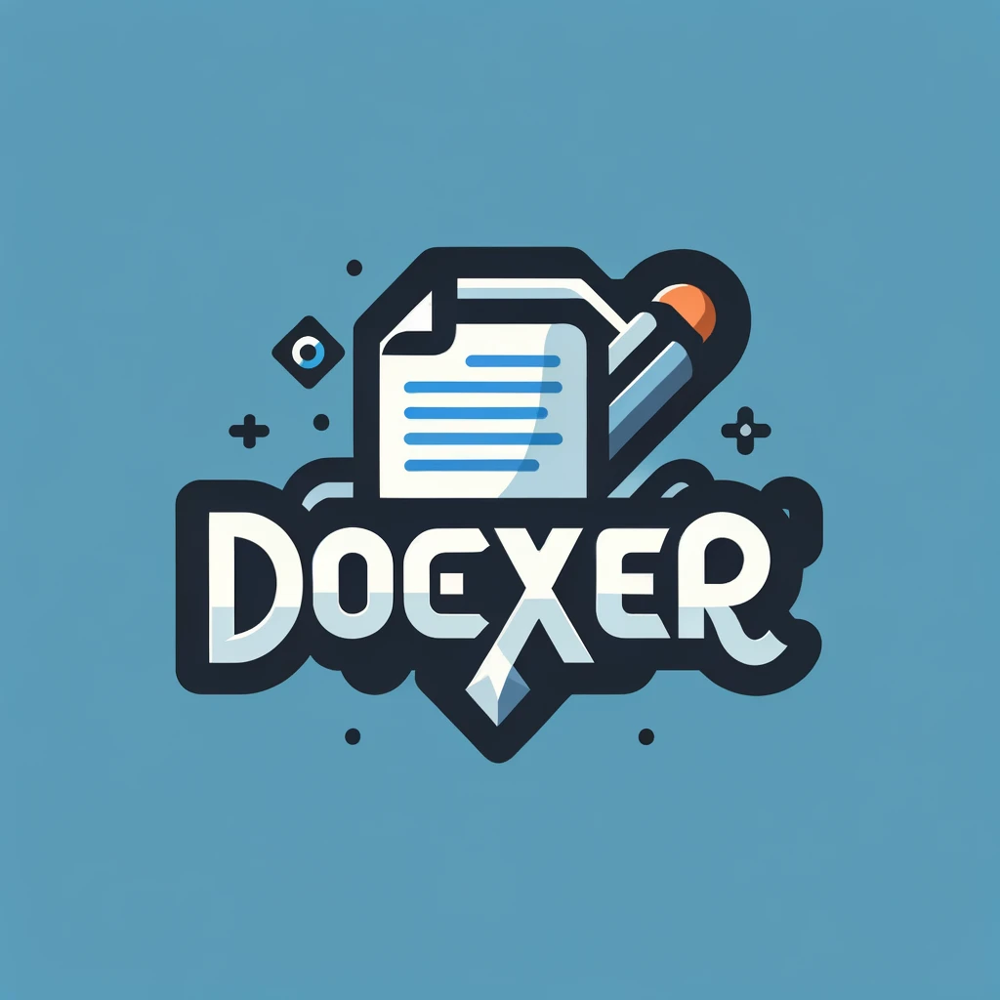

<p align="center">
  
</p>

# docxer

`docxer` is a Go library designed to facilitate DOCX document generation and manipulation. It provides a straightforward and efficient way to programmatically create and modify DOCX files directly from your Go applications.
## Features

- **Create DOCX Files:** Generate new DOCX documents and write basic, unstyled text into them. (Done)
- **Text Styling and Markers:** Enhance your text with rich styling options and utilize markers to apply consistent styles.
- **Template Processing:** Embed placeholders in your templates and replace them dynamically with various content types, supporting loops and conditional logic.
- **Document Manipulation:** Insert, delete, or modify elements like paragraphs, tables, images, and more.
- **Format Conversions:**
  - **DOCX to PDF:** Convert DOCX files into PDF format, preserving layout and content.
  - **DOCX to HTML:** Transform DOCX documents into HTML for web publication.
  - **DOCX to XML:** Export DOCX content to XML for data interchange or processing.
- **Markdown Support:** Convert Markdown text into styled DOCX content, maintaining the formatting.
- **Merge Documents:** Combine multiple DOCX files into a single document with configurable section breaks.

## Getting Started

### Prerequisites

Ensure you have Go installed on your system. `docxer` requires Go version 1.x.x or higher.

### Installation

To start using `docxer`, install it using `go get`:

```bash
go get github.com/aliamerj/docxer
```
## Usage

`docxer` makes it easy to create new DOCX files and set basic content. Here's how you can create a document with a title and body:

```go
// Initialize a new docxer instance
dx := docxer.New()
// Set the title and body of your document
dx.Title = "My Title"
dx.Body = "This is the document body."
// Create a new DOCX file in the current directory
path, err := dx.CreateNewDocx(".")
if err != nil {
  log.Fatal(err)
}
// Output the path to the created document
fmt.Println("Document created at:", path)
```
### Contributing
We welcome contributions to docxer! If you have suggestions or want to contribute to the development of new features, please feel free to create issues or submit pull requests.
